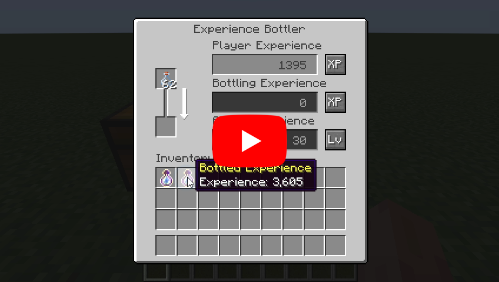
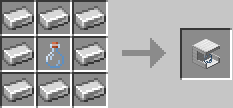

# Experience Bottler - Minecraft Mod for Fabric

Add a block that can be used to bottle any quantity of experience points. The bottled experience points can be drunk like a potion, giving the experience points to user.

## How to install

As with other mods, there is nothing special to do, just place the mod files in the mods folder of the environment where Fabric is installed. Also, don't forget about the Fabric API.

## How to use

Experience values can be bottled in any quantity from 1 to 2147483647 into an empty bottle by using the GUI. Up to 64 bottled experience values can be stacked. However, this requires that the quantity of bottled experience must be the same.

A working demo has been uploaded to [YouTube](https://youtu.be/ZtUIFA9R_CE).

## About rare case bugs

If a player's level is abnormally high, the experience calculation logic may not work correctly. This does not occur unless the player's level exceeds 21863, so it generally doesn't matter to most players, but keep it in the back of your mind.

## Recipes

### Experience Bottler

## Languages

| Language | Translators | Status |
| --- | --- | --- |
| en_us | Translation Tools | 100% |
| ja_jp | EideeHi | 100% |
| fr_fr | ɪѕнɪ_ѕαʍα | 100% |
| es_es | Bruno Collazo | 100% |

## Contacts

[Open an issue](https://github.com/eideehi/mc-experiencebottler/issues) for bug reports. Only bug reports are accepted under Issues.

## Credits

- **Dependencies**:
  - [Fabric](https://fabricmc.net/)
- **Translators**:
  - ɪѕнɪ_ѕαʍα (ishi_sama)
  - Bruno Collazo (BrunoCollazo)
- **Contributors**:
  - Kyle Foley (kFo)
  - Ashwin (tester248)

## License

Experience Bottler is developed and released under the MIT license. For the full text of the license, please see the [LICENSE](LICENSE) file.
